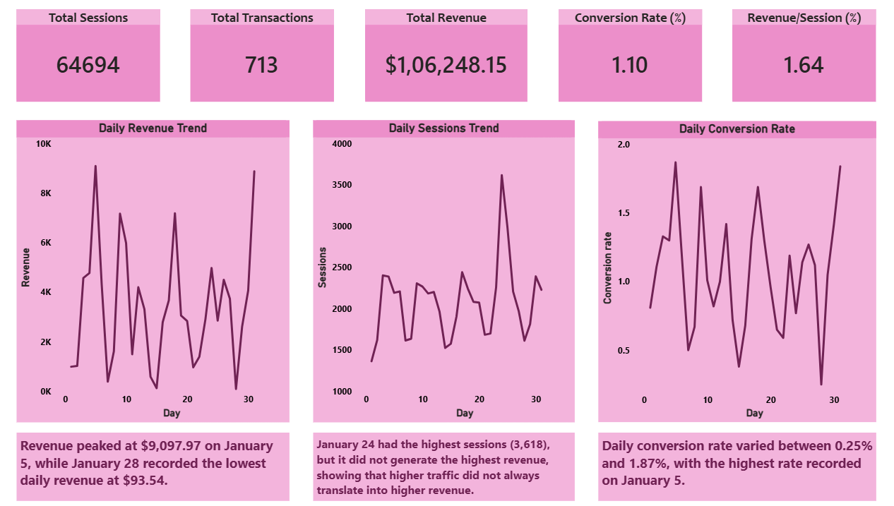
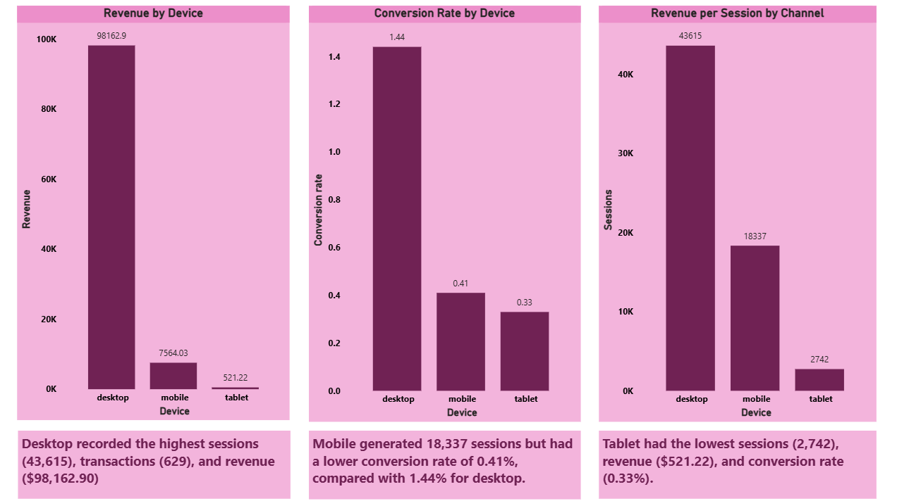
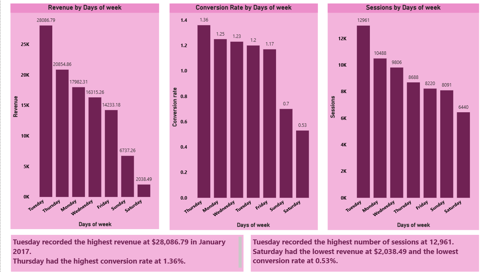
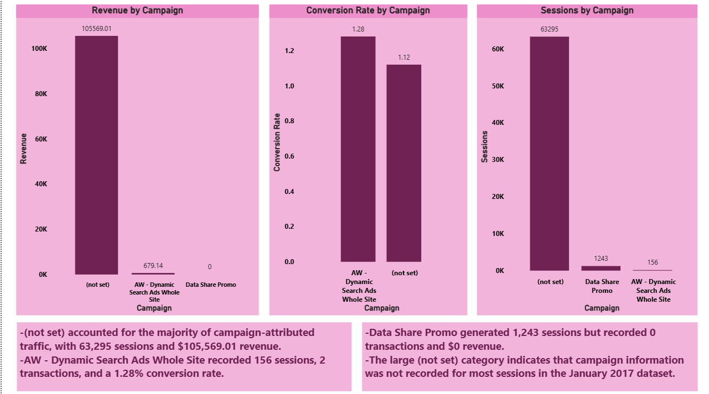

# Marketing Campaign Performance Analytics

## 📌 Project Overview

This project analyzes digital marketing and website performance data to understand traffic sources, marketing channels, campaign performance, user behavior, conversions, and revenue.

The analysis was performed using the **Google Analytics Sample Dataset** for **January 2017**, with SQL in Google BigQuery and an interactive dashboard created in Power BI.

## 🎯 Objectives

* Analyze website traffic across different marketing channels
* Measure conversions and conversion rates
* Compare revenue generated by different channels
* Analyze device-wise user behavior and performance
* Identify daily and day-of-week performance patterns
* Evaluate campaign-level traffic, conversions, and revenue
* Calculate revenue per session to understand channel efficiency

## 📊 Dataset

**Source:** Google Analytics Sample Dataset available through Google BigQuery Public Datasets

**Analysis Period:** January 1–31, 2017

The analysis uses session-level Google Analytics data including:

* Traffic source and medium
* Marketing channel
* Campaign
* Device category
* Sessions
* Transactions
* Pageviews
* Transaction revenue

Revenue values were converted from micros to USD.

## 🛠️ Tools & Technologies

* **Google BigQuery** — SQL-based data extraction and analysis
* **SQL** — Data aggregation, filtering, grouping, and KPI calculations
* **Power BI** — Interactive dashboard and data visualization
* **CSV** — Storage of aggregated analysis outputs

## 🔍 SQL Analysis

The SQL analysis includes:

1. Session-Level Data Inspection
2. Source & Medium Performance
3. Campaign Performance
4. Full January Channel Performance
5. Device Performance
6. Daily Revenue & Conversion Trend
7. Day-of-Week Performance
8. Revenue per Session by Channel
9. Conversion Efficiency by Channel
10. Overall KPIs
11. Full January Campaign Performance

## 📈 Power BI Dashboard

The dashboard contains five pages:

### 1. Executive Overview

Provides an overall view of:

* Total Sessions
* Total Transactions
* Total Revenue
* Conversion Rate
* Revenue per Session
* Daily revenue trends
* Daily session trends
* Daily conversion trends

### 2. Channel Analysis

Compares marketing channels using:

* Revenue
* Conversion Rate
* Revenue per Session

### 3. Device Analysis

Analyzes performance across:

* Desktop
* Mobile
* Tablet

Metrics include revenue, conversion rate, and sessions.

### 4. Time Analysis

Analyzes performance by day of the week using:

* Revenue
* Conversion Rate
* Sessions

### 5. Campaign Analysis

Evaluates campaign-level performance using:

* Revenue
* Conversion Rate
* Sessions

Campaigns with missing campaign information are represented as **"(not set)"**.

## 🖼️ Dashboard Preview

### Executive Overview



### Channel Analysis


### Device Analysis



### Time Analysis



### Campaign Analysis



## 💡 Key Insights

* The dataset recorded **64,694 sessions**, **713 transactions**, and approximately **$106,248.15 in revenue** during January 2017.
* **Referral** generated the highest channel revenue at approximately **$47,113.45** and recorded a **4.26% conversion rate**.
* **Organic Search** generated the highest number of sessions at **28,769**, but its conversion rate was **0.72%**.
* **Desktop** generated the majority of revenue, with approximately **$98,162.90**.
* **Referral** recorded the highest revenue per session at approximately **$6.16**.
* A large proportion of sessions had campaign information recorded as **"(not set)"**, limiting campaign-level attribution for much of the dataset.
* **January 5** recorded the highest daily revenue at approximately **$9,097.97**.

## 📁 Project Structure

```text
Marketing-Campaign-Performance-Analytics/
│
├── README.md
├── SQL/
│   └── marketing_campaign_analysis.sql
│
├── Data/
│   ├── overall_kpis_jan2017.csv
│   ├── channel_performance_jan2017.csv
│   ├── revenue_per_session_channel_jan2017.csv
│   ├── device_performance_jan2017.csv
│   ├── daily_performance_jan2017.csv
│   ├── day_of_week_performance_jan2017.csv
│   └── campaign_performance_jan2017.csv
│
├── Dashboard_Screenshots/
│   ├── executive_overview.png
│   ├── channel_analysis.png
│   ├── device_analysis.png
│   ├── time_analysis.png
│   └── campaign_analysis.png
│
└── PowerBI/
    └── Marketing_Campaign_Performance_Analytics.pbix
```

## 📌 Notes

* The analysis is based on the Google Analytics Sample Dataset for January 2017.
* Revenue is presented in USD.
* The project focuses on descriptive analysis of the available dataset and does not infer the causes behind observed performance differences.
* Campaigns with missing campaign names are categorized as **"(not set)"** rather than removed from the analysis.
